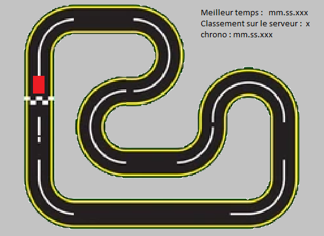

# pytactxv2_race

# Turbo Vroum

# Description

Ce jeu est un jeu de course en vue du dessus s'inspirant du principe de la série de jeux vidéo [TrackMania](https://fr.wikipedia.org/wiki/TrackMania).
    
- **🎯 Contexte & cahier des charges** : 

Dans le cadre de notre troisième année de formation en BUT Informatique, en cours de Programmation avancée, nous  avons été chargés de développer un jeu en utilisant l'API de [PytactX](https://tutos.jusdeliens.com/index.php/2023/04/27/pytactx-creez-vos-propres-regles-du-jeu/).

- **🎲 Règles du jeu** :

Le jeu consiste à déplacer une voiture sur un plateau de jeu définit par un circuit. Le but étant de réaliser le tour le plus rapide dans le temps impartit. Vous serez en concurrence avec d'autres joueurs avec qui vous vous batterez pour la première place. 



- **🎮 Use cases**:

| N°  | Actions                                                                                                                  | Priorité |
| --- | ------------------------------------------------------------------------------------------------------------------------ | -------- |
| 1   | En tant que joueur, je peux participer à des courses multijoueurs et défier d'autres joueurs.                            | 1        |
| 2   | En tant que joueur, je peux contrôler le déplacement d'un véhicule (accélération, freinage, direction)                   | 2        |
| 3   | En tant que joueur, je peux voir mes statistiques de course (chrono, classement, meilleur temps personnel) en temps réel.| 3        |
| 4   | En tant que joueur, je peux recommencer le circuit en plein mileu de la course.                                          | 4        |
| 5   | En tant que joueur, je peux changer la couleur de mon véhicule                                                           | 5        |

      
- **🖧 Architecture matériel** (optionnel, peut être décrit avec le diagramme de séquence) : schéma overview présentant les machines et protocoles (serveurs, clients, broker) avec texte expliquant le choix des technologies 

- **📞 Diagramme de séquence**: expliquer le déroulé d'une partie, les principales étapes à faire dans l'ordre et qui/quoi/comment, les couches s'échangent quelles données pour qui/pour quoi

- **✅ Pré-requis** 
    - Environnement de développement ([VSCode](https://code.visualstudio.com/) ou [Replit](https://replit.com/))
    - [README API](src/api/README.md)
    - [Git](https://git-scm.com/book/en/v2/Getting-Started-Installing-Git)
- **⚙️ Installation** :
    - Ouvrir un invite de commandes
    - Cloner le projet
    ```
    git clone https://github.com/ThomasHawk11/pytactxv2_race.git
    ```
    - Se rendre sur le [circuit]()
- **🧪 Tests**: 
    - définition du plan de test ce qu'on attend quand on fait quoi 
    - step by step pour lancer les tests
- **🛣️ Roadmap**
- **🧑‍💻 Thomas PLANTAIS, Mathieu ORDONNAUD, Mylan MEGARD**
- **⚖️ License [CC BY-NC 4.0 Deed](https://creativecommons.org/licenses/by-nc/4.0/)**
